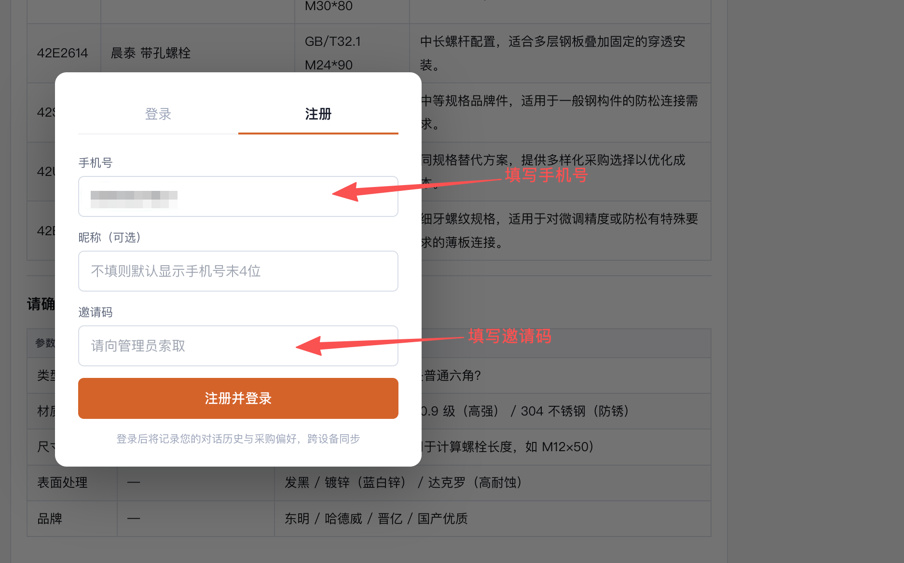
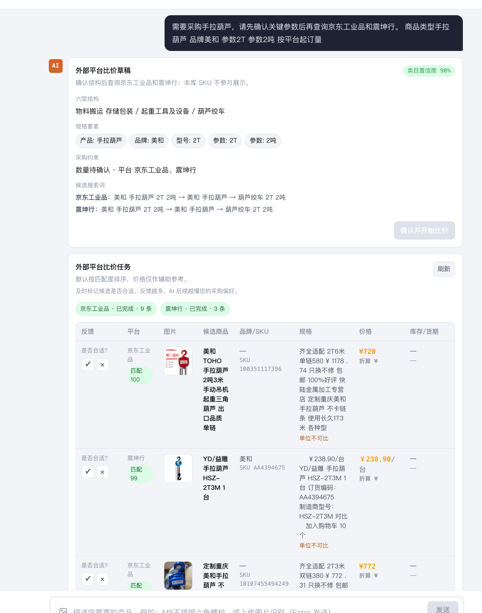

# MRO 工业品 AI 采购助手 — 产品手册

> 智能化的工业品采购对话系统，覆盖 200 万+ SKU，支持自然语言询价、批量匹配、竞品比价、个性化记忆。

访问地址：https://mro.fultek.ai

---

## 目录

1. [产品概述](#1-产品概述)
2. [注册与登录](#2-注册与登录)
3. [智能对话](#3-智能对话)
4. [商品搜索能力](#4-商品搜索能力)
5. [竞品比价](#5-竞品比价)
6. [批量询价](#6-批量询价)
7. [个人记忆与偏好](#7-个人记忆与偏好)
8. [产品反馈](#8-产品反馈)
9. [采购历史导入](#9-采购历史导入)
10. [使用技巧](#10-使用技巧)
11. [常见问题](#11-常见问题)

---

## 1. 产品概述

### 1.1 它能做什么

- **自然语言找货**：用日常说法描述需求（"配套磨机 MFB381125 的 O 型圈"），AI 自动转成结构化搜索
- **图片识别找货**：拍照或截图上传，AI 识别产品类型与规格
- **批量询价**：上传 Excel/CSV，一次匹配几百行需求
- **跨平台比价**：每次询价同步给出网络参考价
- **个性化推荐**：使用越多越懂你，自动学习你的品牌偏好与常用规格

### 1.2 它适合谁

- **企业采购**：快速对比品牌、规格、价格，缩短询价周期
- **工程师/技术员**：用专业术语和标准号（DIN/ISO/GB）精准检索
- **采购新手**：不会描述也没关系，AI 会引导式追问帮你确认参数

### 1.3 数据覆盖

| 维度 | 数量 |
|---|---|
| L1 大类 | 3（紧固密封 / 工具耗材 / 物料搬运）|
| L2 品类 | 35 |
| L3 子类 | 80+ |
| SKU 总量 | 200 万+ |

---

## 2. 注册与登录

### 2.1 首次注册

1. 打开 https://mro.fultek.ai
2. 系统会自动弹出登录窗口
3. 切换到"**注册**"标签
4. 填写：
   - **手机号**：11 位中国大陆手机号
   - **昵称**（可选）：留空将默认显示"用户XXXX"（手机号末 4 位）
   - **邀请码**：Fultek-AI-2026



5. 点击"注册并登录"

> **注意**：邀请码限制是为了防止陌生人随意注册占用资源。同一邀请码可供所有受邀用户使用。

### 2.2 已注册用户登录

切换到"**登录**"标签，仅需输入手机号即可登录（无需密码）。

### 2.3 退出登录

侧边栏左下角，鼠标移到用户卡片右侧的退出图标，点击即退出。

### 2.4 跨设备使用

同一手机号在任何设备上登录，**对话历史、偏好设置、采购记忆全部同步**。

---

## 3. 智能对话

界面整体布局如下：左侧为会话列表与导航，右侧为对话区，输入框支持文字与图片混合输入：



### 3.1 四种查询模式（系统自动判断）

| 模式 | 触发条件 | 你说 | 系统响应 |
|---|---|---|---|
| **精确查询** | 已知品类 + 规格/标准 | "DIN931 M8×40 不锈钢螺栓" | 直接展示最多 20 个匹配 SKU |
| **品类已知** | 知道品类，缺规格 | "M8 螺栓"、"O型圈" | 8 个产品 + 5 维参数确认表 |
| **场景描述** | 描述用途 | "固定钢板用什么螺丝" | 5 个推荐 + 专家推断 + 参数追问 |
| **模糊询问** | 只有大类 | "买螺丝"、"找扳手" | 3 个样例 + 引导式选择 |

### 3.2 参数追问 chip 卡

当系统对你的需求理解不充分时，会以 chip 卡的形式列出已知参数和待确认维度：

- **需求概述**：一句话总结你的当前意图（每轮重新合成）
- **已知参数**：对话上下文中已确认的字段（如 商品类型、规格、品牌）
- **待确认维度**：每个维度配 emoji 图标 + 中文问题 + 3-5 个候选 chip

操作方式：

- 点击任意 chip 选项，被选中的项会以 tag 形式回显在卡片底部
- 同维度内单选（再点同一个会取消，点别的会替换）
- 在输入框补充自由文本（如"长度 50mm、急用 5 件"）
- 点击"提交"或按回车将所选 chip + 自由文本一起发送

特殊场景：

- **只输入品牌名**（如"美和"）：系统聚合该品牌下的 L3 品类分布，以 chip 形式列出，点击即可锁定品类继续搜索
- **品牌别名归一**：输入"TOHO"会自动归一到"美和"，"搬运"会归一到"物料搬运 存储包装"
- **3 轮上限**：最多追问 3 轮，到达上限后系统会用已收集的信息直接搜索，不再追问

### 3.3 图片识别

1. 在输入框点击图片图标（或拖拽图片到输入框）
2. 添加文字描述（可选，例如"识别这是什么型号"）
3. 点击发送

AI 会识别产品类型、可见规格（尺寸、材质标识、标准编号），并匹配库内对应 SKU。

支持格式：JPG / PNG / WebP

### 3.4 对话上下文

系统记住当前会话最近 6 轮对话内容，可以无缝追问：

```
你：找一下 O 型圈
AI：[展示 8 个 + 参数确认表]
你：要 304 不锈钢的
AI：[在上一轮基础上加上 304 过滤]
```

### 3.5 多会话管理

- **新建对话**：左侧"+ 新建对话"按钮
- **切换历史**：左侧会话列表点击切换（消息按需加载）
- **删除会话**：鼠标悬停在会话项右侧，点击删除按钮，确认即可

> 所有对话历史**实时保存到服务端**，刷新页面、关闭浏览器、换设备都不会丢失。每个账户保留最近 200 条会话，超出自动清理最旧的。

---

## 4. 商品搜索能力

### 4.1 级联放宽搜索

无结果时系统自动逐步放宽，直到找到候选：

```
精确（分类 + 关键词 + 规格 + 品牌）
  ↓ 无结果
去掉规格
  ↓ 无结果
去掉 L4 分类
  ↓ 无结果
去掉 L3 分类，只保留品类大词
  ↓ 无结果
单关键词搜索
  ↓ 无结果
告知"无完全匹配"，给出同品类替代品
```

### 4.2 设备配套搜索

如果你的产品是某台设备的配件，请在描述中**明确写出"配套"或"适用于"+ 设备型号**：

<span style="color:#16a34a">✓</span> "配套磨机 MFB381125 的 O 型圈"  
<span style="color:#16a34a">✓</span> "适用于 KUKA 机器人 KR210 的密封圈"  

系统会优先在厂商型号字段（mfg_sku）中匹配，配套产品排在最前。

### 4.3 标准编号自动等效

当结果不足 3 条时，系统自动搜索等效标准：

| 你搜的 | 自动扩展到 |
|---|---|
| DIN931 | ISO4014 / GB/T5782 |
| DIN912 | ISO4762 / GB/T70 |
| DIN125 | ISO7089 / GB/T97 |
| DIN985 | ISO10511 / GB/T6172 |

并在回复中明确告知"已为您搜索等效标准"。

### 4.4 商品附件

每个搜索结果可能附带相关文档（按类型用不同颜色标识）：

- <span style="color:#16a34a;font-size:18px">●</span> **认证证书**（绿）：MSDS / RoHS / 3.1 证书等
- <span style="color:#2563eb;font-size:18px">●</span> **技术资料**（蓝）：技术参数、安装说明
- <span style="color:#ea580c;font-size:18px">●</span> **检测报告**（橙）：第三方检测结果
- <span style="color:#9333ea;font-size:18px">●</span> **相关文档**（紫）：选型指南等

点击附件直接打开（新标签页）。

---

## 5. 竞品比价

### 5.1 自动获取网络参考价

每次询价系统会**并行**搜索公开网络上的对应产品，与库内匹配结果一起展示。

显示信息：
- 商品名 / 品牌 / 单价 / 单位
- 货期（工作日）
- 商品链接（点击查看出处）

### 5.2 注意事项

- 网络参考价仅供比对参考，最终成交价以你与供应商谈判为准
- 接口偶尔超时，超时则不展示比价（不影响主搜索）
- 设备型号会被自动从竞品搜索词中剔除（避免搜到设备本体）

---

## 6. 批量询价

### 6.1 适用场景

收到一份几十/几百行的需求清单，要快速判断哪些有库内匹配。

### 6.2 操作步骤

1. 顶栏点击"**批量询价**"
2. 选择两种输入方式：
   - **上传文件**：拖拽或点击上传 `.xlsx` / `.xls` / `.csv`（最多 200 行，5MB 以内）
   - **粘贴文本**：直接粘贴 CSV 格式数据
3. 系统自动识别表头，开始批量匹配
4. 进度条完成后显示：
   - 总行数 / 已匹配 / 未匹配 三个汇总卡片
   - 每行展示前 5 个匹配
5. 点击右上角"**导出 CSV**"下载完整结果

### 6.3 表头识别

系统支持以下别名（任意一个即可）：

| 标准列名 | 支持的别名 |
|---|---|
| 需求品名 | 品名、产品名称、名称、product |
| 需求品牌 | 品牌、brand |
| 需求型号 | 型号、规格、spec、model |
| 采购数量 | 数量、qty、quantity |

不区分大小写，会自动忽略空格。

### 6.4 模板下载

页面有"**下载模板**"链接，可获取标准格式的询价表 Excel。

---

## 7. 个人记忆与偏好

### 7.1 三类记忆

| 类型 | 何时写入 | 内容 |
|---|---|---|
| **对话记录** | 每轮对话后 | 你的问题、识别品类、TOP 5 匹配商品 |
| **产品反馈** | 你点 <span style="color:#16a34a;font-weight:bold">▲赞</span>/<span style="color:#dc2626;font-weight:bold">▼踩</span> 时 | 操作、产品名、品牌、品类、规格 |
| **偏好摘要** | 每 10 次对话自动聚合 | 偏好品牌 Top5 / 常用品类 Top4 / 常用规格 Top5 |

### 7.2 用户专业程度自动识别

系统根据你的查询风格自动判断（专家 / 中级 / 新手），并调整响应：

- **专家**：直接给精准结果，减少解释，使用技术术语
- **中级**：正常推荐 + 必要时确认细节
- **新手**：详细引导，解释产品差异，逐步明确需求

### 7.3 记忆隔离

每个手机号对应独立的记忆空间，账户之间完全互不可见。

### 7.4 记忆持久化

- 对话历史存于服务端 MySQL，跨设备同步，最多保留 200 条/账户
- session_count（对话计数）持久化在数据库，重启不丢失
- 长期记忆（偏好/反馈）存于 Memos 服务，docker volume 持久化

---

## 8. 产品反馈

### 8.1 给商品打标

每个搜索结果卡片右下角有 <span style="color:#16a34a;font-weight:bold">▲赞</span>/<span style="color:#dc2626;font-weight:bold">▼踩</span> 按钮：

- **<span style="color:#16a34a;font-weight:bold">▲赞</span> 感兴趣**：标记为"喜欢"，会提升该品牌/品类在未来推荐中的权重
- **<span style="color:#dc2626;font-weight:bold">▼踩</span> 不符合需求**：标记为"不感兴趣"，未来不再优先推荐

> 每个商品只能投票一次，投票后按钮置灰。

### 8.2 反馈如何影响推荐

- 同品牌产品被多次点<span style="color:#16a34a;font-weight:bold">▲赞</span> → 系统认为你偏好该品牌
- 同品类商品被多次点<span style="color:#dc2626;font-weight:bold">▼踩</span> → 系统在搜索时降权该品类
- 累计 10 次会话后，自动整理一份"偏好摘要"

---

## 9. 采购历史导入

### 9.1 用途

如果你有过往的 ERP 采购记录，**一次性上传可以让 AI 立刻"读懂你"**——无需慢慢积累，直接获得个性化推荐。

### 9.2 操作

1. 侧边栏底部"**导入采购历史**"按钮
2. 上传 `.xlsx` / `.xls` / `.csv`（最多 10MB）
3. 系统自动提取：
   - 高频品牌（Top 5）
   - 高频规格（Top 5）
4. 写入你的偏好档案，立刻生效

### 9.3 文件格式要求

至少包含**产品编码**或**产品名称**列。其他字段（品牌、规格、数量、价格）会被自动识别。

---

## 10. 使用技巧

### 10.1 快速精准搜索

直接说出标准编号 + 规格 + 材质，可一步到位：

<span style="color:#16a34a">✓</span> "DIN933 M10×30 304 不锈钢"  
<span style="color:#16a34a">✓</span> "ISO4762 M8×40 8.8级 黑氧化"  

### 10.2 配套件搜索关键词

<span style="color:#16a34a">✓</span> "配套 + 设备型号"  
<span style="color:#16a34a">✓</span> "适用于 + 设备型号"  

<span style="color:#dc2626">✗</span> 直接搜设备型号（系统会以为你在找整机）

### 10.3 批量询价提效

- 列名标准化（用"需求品名/品牌/型号/数量"）
- 一次最多 200 行，超过分批
- 使用模板可避免列名识别失败

### 10.4 提升推荐质量

- 多用 <span style="color:#16a34a;font-weight:bold">▲赞</span>/<span style="color:#dc2626;font-weight:bold">▼踩</span> 给搜索结果打标
- 上传采购历史一次性建档
- 在对话中明确说出偏好品牌（"我们公司一般用施耐德"）

---

## 11. 常见问题

### Q1: 邀请码忘了怎么办？

向管理员索取或在群内询问。

### Q2: 注册时提示"邀请码错误"？

确认邀请码大小写完全一致。当前邀请码为 `Fultek-AI-2026`（区分大小写）。

### Q3: 登录时提示"该手机号未注册"？

请先用邀请码注册。

### Q4: 在另一台设备登录后，对话历史能同步吗？

**完全同步**。对话历史、采购偏好、产品反馈、记忆系统都存于服务端，绑定到你的手机号。换设备登录后所有历史会话自动出现，包括历史搜索结果、竞品报价、上传过的图片。

每个账户最多保留 **200 条** 历史会话，超过会自动清理最旧的。

### Q5: 搜不到我要的产品怎么办？

1. 换关键词（用产品的标准名而非俗称）
2. 提供更多线索（标准号、设备型号、应用场景）
3. 系统提示"无完全匹配"时会自动给替代品参考

### Q6: 批量询价上传后没有匹配结果？

- 检查列名是否正确
- 检查产品名是否过于宽泛（如只写"螺丝"，建议加规格）
- 单元格里不要有不可见字符

### Q7: 为什么有时回复速度慢？

精确查询通常 3-5 秒，复杂的引导式追问可能 8-15 秒。如果超过 30 秒，请刷新页面重试。

### Q8: 网络参考价不准/比库内贵很多怎么办？

网络参考价取自公开市场，企业批量采购通常有协议价。库内为合作渠道实际价格，请以库内为准，网络价仅作参考。

### Q9: 我能删除自己的记忆吗？

目前需联系管理员协助删除（后续会开放用户自助删除入口）。

### Q10: 数据安全吗？

- 所有用户数据隔离存储，不同账户互不可见
- 手机号仅用于身份识别，不用于其他用途
- 对话记录仅供本账户调取上下文

---

## 联系与反馈

- 产品反馈 / 功能建议：联系管理员
- 数据问题 / SKU 错误：在对应商品上点 <span style="color:#dc2626;font-weight:bold">▼踩</span> 并备注

---

*版本：v1.0 · 文档更新日期：2026-04-27*
